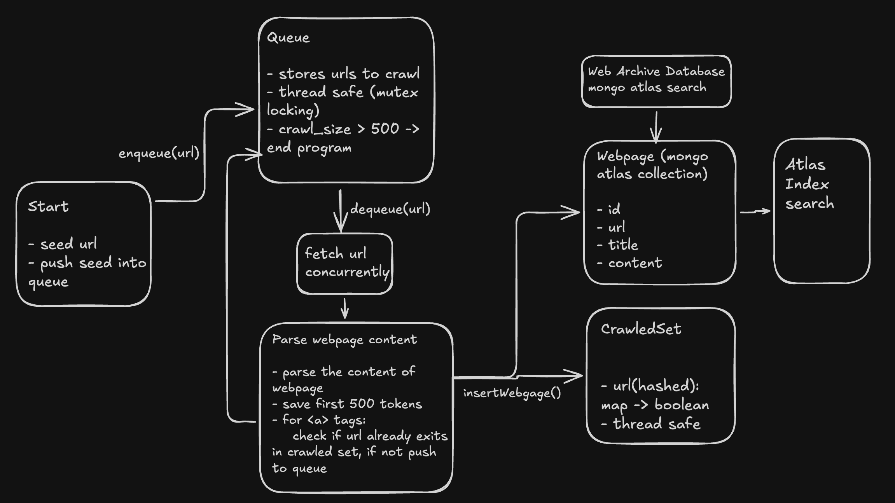
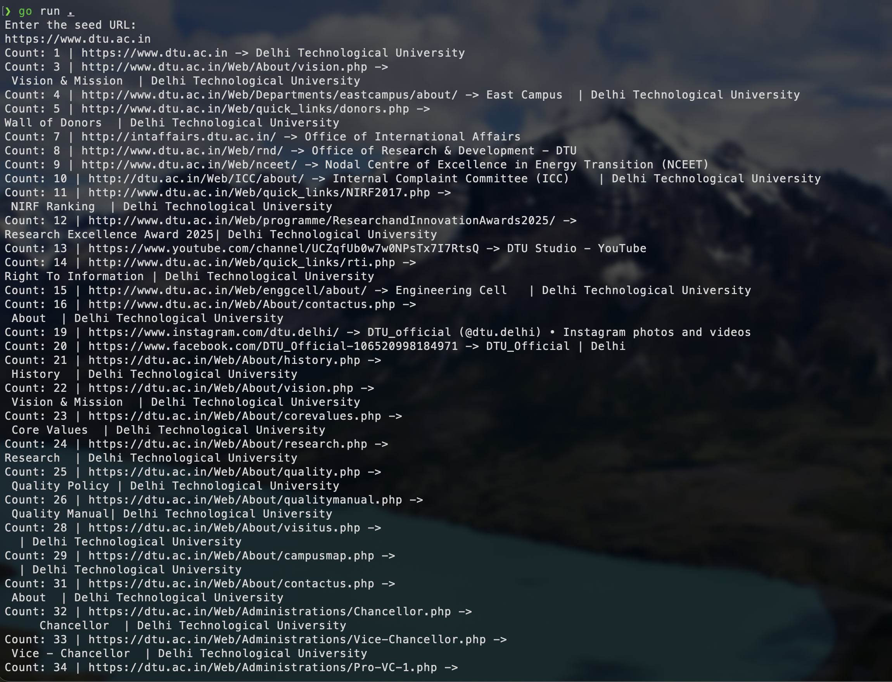
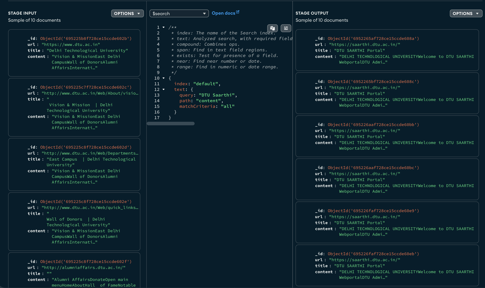

# Web Crawler

A high-performance, concurrent web crawler built in Go that crawls websites, extracts links, and stores webpage data in MongoDB. The crawler includes real-time statistics tracking, duplicate URL detection, and efficient queue management.

## Architecture


The crawler consists of several key components:

- **Queue**: Thread-safe queue for managing URLs to be crawled
- **CrawledSet**: Hash-based set for tracking already crawled URLs
- **DatabaseConnection**: MongoDB connection handler for storing webpage data
- **CrawlerStats**: Statistics tracker for monitoring crawl performance
- **Webpage**: Data structure for storing webpage information (URL, title, content)

## Prerequisites

- Go 1.25.3 or higher
- MongoDB (optional, for storing crawled data)
- `.env` file with MongoDB connection string (optional)

## Installation

1. Clone the repository:
```bash
git clone https://github.com/Kanishk-03-Jain/web-crawler.git
cd web-crawler
```

2. Install dependencies:
```bash
go mod download
```

3. (Optional) Create a `.env` file for MongoDB connection:
```env
MONGODB_URI=your_mongodb_connection_string
```

## Usage

1. Run the crawler:
```bash
go run .
```

2. Enter a seed URL when prompted:
```
Enter the seed URL:
https://example.com
```

3. The crawler will:
   - Start crawling from the seed URL
   - Extract links and add them to the queue
   - Store webpage data in MongoDB (if configured)
   - Display real-time statistics every minute
   - Stop after crawling 5000 pages or when the queue is empty

## Example Output

### CLI Output



The crawler displays real-time progress showing:
- Current crawl count
- URL being processed
- Page title

### Search Results



After crawling, you can search the MongoDB database to view stored webpage data.

## How It Works

1. **Initialization**: The crawler connects to MongoDB (if configured) and initializes data structures
2. **Seed URL**: User provides a starting URL
3. **Crawling Loop**:
   - Dequeue a URL from the queue
   - Fetch the webpage content using HTTP GET request
   - Parse HTML to extract:
     - Page title
     - Links (href attributes)
     - Page content (first 500 characters from body)
   - Add new links to the queue (if not already crawled)
   - Store webpage data in MongoDB
4. **Statistics**: Every minute, the crawler updates and displays:
   - Pages crawled per minute
   - Crawl-to-queue ratio
5. **Termination**: Stops when queue is empty or 5000 pages are crawled

## Configuration

- **Max Pages**: Set in `main.go` (default: 5000)
- **Max Content Length**: Set in `webpage.go` (default: 500 characters)
- **Max Tokens**: Set in `webpage.go` (default: 500 tokens per page)
- **Database Storage Limit**: Set in `webpage.go` (default: 1000 pages stored)

## Project Structure

```
web-crawler/
├── main.go                 # Main entry point and orchestration
├── queue.go                # Thread-safe queue implementation
├── CrawledSet.go           # Hash-based set for duplicate detection
├── DatabaseConnection.go   # MongoDB connection and operations
├── CrawlerStats.go         # Statistics tracking
├── webpage.go              # Webpage fetching and HTML parsing
├── go.mod                  # Go module dependencies
├── go.sum                  # Dependency checksums
├── images/                 # Screenshots and documentation images
│   ├── cli-output.png
│   └── Search-output.png
└── README.md               # This file
```

## Dependencies

- `github.com/joho/godotenv` - Environment variable management
- `go.mongodb.org/mongo-driver/v2` - MongoDB driver
- `golang.org/x/net` - HTML parsing utilities

## Limitations

- Crawls up to 5000 pages per run
- Stores only first 500 characters of page content
- Processes up to 500 HTML tokens per page
- Requires valid HTTP URLs (skips relative URLs)
- User-Agent is set to "MyBot/1.0"

## Future Enhancements

- [ ] Add support for robots.txt compliance
- [ ] Implement rate limiting
- [ ] Add support for different content types (PDF, images, etc.)
- [ ] Implement depth-based crawling limits
- [ ] Add domain filtering options
- [ ] Support for crawling with authentication
- [ ] Export data to different formats (JSON, CSV)

## Author

**Kanishk Jain**
- GitHub: [@Kanishk-03-Jain](https://github.com/Kanishk-03-Jain)

**Note**: Make sure to respect website terms of service and robots.txt when crawling. Use responsibly and ethically.
